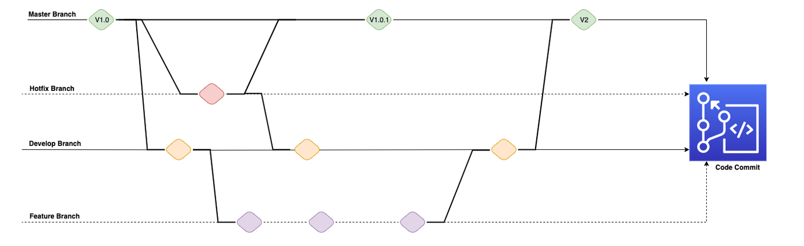
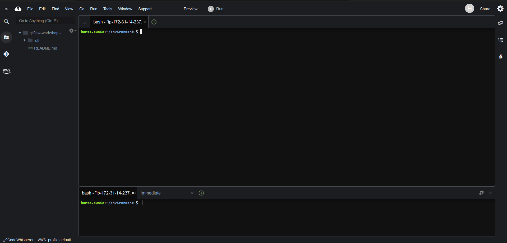
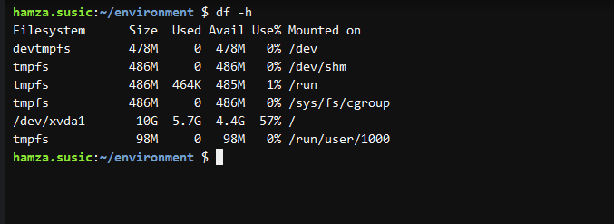
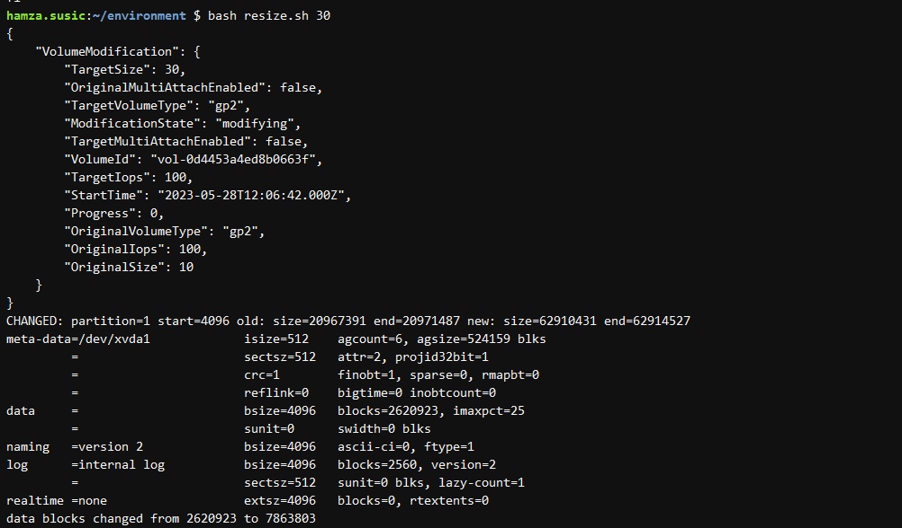

## Branching Models

There are two popular branching models that we see customers typically use in their organization. One is Trunk-based and other is Feature-based or "GitFlow" model.
Trunk-based development

In Trunk-based model, developers collaborate on code in a single branch called “trunk” resisting any pressure to create other long-lived development branches by employing documented techniques. This leads to avoiding merging complexity and hence effort. At Amazon, we strongly encourage our teams to practice Continuous Integration via Trunk-based development where developers merge their changes several times a day into a central repository.
Feature-based aka GitFlow development

So why do teams use Feature-based model? There are several reasons why:

    Not many teams have achieved CI/CD nirvana
    Multiple teams may be working on different feature releases with different launch timelines
    Organizations that provide SAAS (Software As-A Service) may have customers who do not wish to be on the "latest" version at all times, and thus forcing them to create multiple "Release" and "Hotfix" branches
    Certain teams within an Organization may have specific QA/UAT requirements that require manual approvals, that may delay the time since a new feature is introduced until it's released to production


## GitFlow

GitFlow involves creating multiple levels of branching off of master where changes to feature branches are only periodically merged all the way back to master to trigger a release.

    Master always and exclusively contains production code

    Develop is the basis for any new development efforts you make.

These two branches are so-called long-running branches: they remain in your project during its whole lifetime. Other branches, e.g. for features or releases, only exist temporarily: they are created on demand and are deleted after they've fulfilled their purpose.
GitFlow guidelines:

    Use development as a continuous integration branch.
    Use feature branches to work on multiple features.
    Use release branches to work on a particular release (multiple features).
    Use hotfix branches off of master to push a hotfix.
    Merge to master after every release.
    Master contains production-ready code.



## Launch AWS Cloud9 in US-EAST-1:Header anchor link
   
   Sign in to AWS as the IAM user you've configured and open the AWS Cloud9 console.
   In the AWS Cloud9 console, choose Create environment.
   Select Create environment
   Name it gitflow-workshop, and take all other defaults
   When it comes up, customize the environment by closing the welcome tab and lower work area, and opening a new terminal tab in the main work area



## Resize the Cloud9 instance

By default the Amazon EBS volume attached to the Cloud9 instance is 10 GiB, let's confirm this by typing the following in the terminal:

```
df -h
```




he AWS Cloud9 User Guide has instructions on how to Resizing an Amazon EBS volume used by an environment 

, let's follow the guide.

    From the Cloud9 terminal, create a file called resize.sh:
```
touch resize.sh
```
    Open resize.sh in Cloud9 and paste the bash script from the documentation:
```
#!/bin/bash

# Specify the desired volume size in GiB as a command line argument. If not specified, default to 20 GiB.
SIZE=${1:-20}

# Get the ID of the environment host Amazon EC2 instance.
INSTANCEID=$(curl http://169.254.169.254/latest/meta-data/instance-id)
REGION=$(curl -s http://169.254.169.254/latest/meta-data/placement/availability-zone | sed 's/\(.*\)[a-z]/\1/')

# Get the ID of the Amazon EBS volume associated with the instance.
VOLUMEID=$(aws ec2 describe-instances \
  --instance-id $INSTANCEID \
  --query "Reservations[0].Instances[0].BlockDeviceMappings[0].Ebs.VolumeId" \
  --output text \
  --region $REGION)

# Resize the EBS volume.
aws ec2 modify-volume --volume-id $VOLUMEID --size $SIZE

# Wait for the resize to finish.
while [ \
  "$(aws ec2 describe-volumes-modifications \
    --volume-id $VOLUMEID \
    --filters Name=modification-state,Values="optimizing","completed" \
    --query "length(VolumesModifications)"\
    --output text)" != "1" ]; do
sleep 1
done

#Check if we're on an NVMe filesystem
if [[ -e "/dev/xvda" && $(readlink -f /dev/xvda) = "/dev/xvda" ]]
then
  # Rewrite the partition table so that the partition takes up all the space that it can.
  sudo growpart /dev/xvda 1

  # Expand the size of the file system.
  # Check if we're on AL2
  STR=$(cat /etc/os-release)
  SUB="VERSION_ID=\"2\""
  if [[ "$STR" == *"$SUB"* ]]
  then
    sudo xfs_growfs -d /
  else
    sudo resize2fs /dev/xvda1
  fi

else
  # Rewrite the partition table so that the partition takes up all the space that it can.
  sudo growpart /dev/nvme0n1 1

  # Expand the size of the file system.
  # Check if we're on AL2
  STR=$(cat /etc/os-release)
  SUB="VERSION_ID=\"2\""
  if [[ "$STR" == *"$SUB"* ]]
  then
    sudo xfs_growfs -d /
  else
    sudo resize2fs /dev/nvme0n1p1
  fi
fi
```



## Initial Setup

The git config command is a convenience function that is used to set Git configuration values on a global or local project level. It is best practice to set up your git user.name and user.email when you set up a new Cloud9 environment using the following commands:

```
git config --global user.name "Full Name"
```
```
git config --global user.email email@amazon.com
```
Configure the AWS CLI Credential Helper on Your AWS Cloud9 EC2 Development Environment

After you've created an AWS Cloud9 environment, you can configure the AWS CLI credential helper to manage the credentials for connections to your CodeCommit repository. The AWS Cloud9 development environment comes with AWS managed temporary credentials that are associated with your IAM user. You use these credentials with the AWS CLI credential helper. The credential helper allows Git to use HTTPS and a cryptographically signed version of your IAM user credentials or Amazon EC2 instance role whenever Git needs to authenticate with AWS to interact with CodeCommit repositories.

At the terminal, run the following commands to configure the AWS CLI credential helper for HTTPS connections:


```
git config --global credential.helper '!aws codecommit credential-helper $@'
git config --global credential.UseHttpPath true
```
Install gitflow

gitflow is a collection of Git extensions to provide high-level repository operations for Vincent Driessen's branching model 

At the terminal, run the following commands to install gitflow:
```
curl -OL https://raw.github.com/nvie/gitflow/develop/contrib/gitflow-installer.sh
chmod +x gitflow-installer.sh
sudo git config --global url."https://github.com".insteadOf git://github.com
sudo ./gitflow-installer.sh
```

## Elastic Beanstalk Application

Get a copy of the sample code

In this step, you will retrieve a copy of the sample app’s code and create code commit repo to host the code. The pipeline takes code from the source and then performs actions on it.
Stage 1: Create Code Commit Repo
```
aws codecommit create-repository --repository-name gitflow-workshop --repository-description "Repository for Gitflow Workshop"

```
```
git clone https://git-codecommit.us-east-1.amazonaws.com/v1/repos/gitflow-workshop

```

Stage 2: Download the sample code and commit your code to the repository

    Download the Sample App archive by running the following command from IDE terminal.

```
ASSETURL="https://static.us-east-1.prod.workshops.aws/public/442d5fda-58ca-41f0-9fbe-558b6ff4c71a/assets/workshop-assets.zip"; wget -O gitflow.zip "$ASSETURL"
```
    Unarchive and copy all the contents of the unarchived folder to your local repo folder.

```
unzip gitflow.zip -d gitflow-workshop/
```
    Change the directory to your local repo folder. Run git add to stage the change.

```
cd gitflow-workshop
```
```
git add -A
```
    Run git commit to commit the change and push it to master

```
git commit -m "Initial Commit"
```
```
git push origin master
```
And you should see something similar to:
```
Counting objects: 17, done.
Compressing objects: 100% (16/16), done.
Writing objects: 100% (17/17), 49.62 KiB | 4.96 MiB/s, done.
Total 17 (delta 1), reused 0 (delta 0)
To https://git-codecommit.us-east-1.amazonaws.com/v1/repos/gitflow-workshop
 * [new branch]      master -> master
```

Create Elastic Beanstalk Application

To use Elastic Beanstalk we will first create an application, which represents your web application in AWS. In Elastic Beanstalk an application serves as a container for the environments that run your web app, and versions of your web app's source code, saved configurations, logs, and other artifacts that you create while using Elastic Beanstalk.

Run the following AWS CloudFormation template to create

    Elastic Beanstalk application - think of it as a folder that will hold the components of your Elastic Beanstalk

    S3 bucket for artifacts - place to put your application code before deployment

```
aws cloudformation create-stack --template-body file://appcreate.yaml --stack-name gitflow-eb-app
```

AWS CloudFormation begins creating the resources that are specified in the template. Your new stack, gitflow-eb-app, appears in the list at the top portion of the Cloudformation console 
Its status should be CREATE_IN_PROGRESS. You can see detailed status for a stack by viewing its events.

## Master Environment

Creating an AWS Elastic Beanstalk Master Environment

You can deploy multiple environments when you need to run multiple versions of an application. For example, you might have development, integration, and production environments

Use the following AWS CloudFormation templates to set up the elastic beanstalk application and codepipeline to do auto store the artifacts.

```
aws cloudformation create-stack --template-body file://envcreate.yaml --parameters file://parameters.json --capabilities CAPABILITY_IAM --stack-name gitflow-eb-master
```

Your stack might take several minutes to create—but you probably don't want to just sit around waiting. If you're like us, you'll want to know how the stack creation is going. Your new stack, gitflow-eb-master, appears in the list at the top portion of the Cloudformation console 
Its status should be CREATE_IN_PROGRESS. You can see detailed status for a stack by viewing its events. The CREATE_COMPLETE event is logged when the resource is successfully created.

## AWS CodePipeline

AWS CodePipeline is a continuous delivery service you can use to model, visualize, and automate the steps required to release your software. You can quickly model and configure the different stages of a software release process. CodePipeline automates the steps required to release your software changes continuously.

Above cloudformation template will also create and configure a simple AWS CodePipeline with three actions: source, build and deploy.

After your pipeline is created, the pipeline status page appears and the pipeline automatically starts to run. You can view progress as well as success and failure messages as the pipeline performs each action.

To verify your pipeline ran successfully, monitor the progress of the pipeline as it moves through each stage by going to CodePipeline Console 
The status of each stage will change from No executions yet to In Progress, and then to either Succeeded or Failed. The pipeline should complete the first run within a few minutes.

## Lambda
What Is AWS Lambda ?

AWS Lambda is a compute service that lets you run code without provisioning or managing servers. AWS Lambda executes your code only when needed and scales automatically, from a few requests per day to thousands per second. You pay only for the compute time you consume - there is no charge when your code is not running. With AWS Lambda, you can run code for virtually any type of application or backend service - all with zero administration.

For this workshop we are using lambda function to create codepipeline and elasticbeanstalk when a branch or tag is created.

Create Lambda

You can configure a CodeCommit repository so that code pushes or other events trigger actions, such as invoking a function in AWS Lambda. The following steps include creating a Lambda function which will be used with a CodeCommit trigger.

```
aws cloudformation create-stack --template-body file://lambda/lambda-create.yaml --stack-name gitflow-workshop-lambda --capabilities CAPABILITY_IAM
```

## AWS CodeCommit Trigger

You can configure a CodeCommit repository so that code pushes or other events trigger actions, such as sending a notification from Amazon Simple Notification Service (Amazon SNS) or invoking a function in AWS Lambda. You can create up to 10 triggers for each CodeCommit repository.

Triggers are commonly configured to:

    Send emails to subscribed users every time someone pushes to the repository.

    Notify an external build system to start a build after someone pushes to the main branch of the repository

Create a Trigger in AWS CodeCommit for an Existing AWS Lambda Function

In this step you will create a trigger in CodeCommit which invokes a Lambda function when a branch or tag is created.

    Open the CodeCommit 

console

In Repositories, choose the gitflow-workshop repository where you want to create triggers for repository events.

In the navigation pane for the gitflow-workshop repository, choose Settings, and then choose Triggers. 

Choose Create trigger. In Create trigger, do the following:

    In Trigger name, enter a name for the trigger (for example, CreateBranch).
    In Events, choose the repository events that trigger the Lambda function: Create branch or tag.
    In Branches, leave the selection blank, because this default option applies the trigger to all branches automatically.
    In Choose the service to use, choose AWS Lambda. In Lambda function, choose the function name from the list, or enter the ARN for the function.


Choose Create trigger. In Create trigger, do the following:

    In Trigger name, enter a name for the trigger (for example, DeleteBranch).
    In Events, choose the repository events that trigger the Lambda function: Delete branch or tag.
    In Branches, leave the selection blank, because this default option applies the trigger to all branches automatically.
    In Choose the service to use, choose AWS Lambda. In Lambda function, choose the function name from the list, or enter the ARN for the function. 

## Develop Branch

Create Develop Branch

When using the git-flow extension library, executing git flow init on an existing repo will create the develop branch:

Initialize gitflow

```
Admin:~/environment/gitflow-workshop (master) $ git flow init

Which branch should be used for bringing forth production releases?
- master
Branch name for production releases: [master]
Branch name for "next release" development: [develop]

How to name your supporting branch prefixes?
Feature branches? [feature/]
Release branches? [release/]
Hotfix branches? [hotfix/]
Support branches? [support/]
Version tag prefix? []
```

List the current branches. The current branch will be highlighted in green and marked with an asterisk.

```
Admin:~/environment/gitflow-workshop (master) $ git branch
* develop
 master
```
Push commits made on a local branch to a remote repository.
```
Admin:~/environment/gitflow-workshop (develop) $ git push -u origin develop
```
## Create Development Environment

After pushing the commits to development branch, the lambda function you created earlier will automatically detect a new develop branch created and codecommit will trigger the function to create the development environment and code pipeline.

Your new stack, gitflow-workshop-develop, appears in the list at the top portion of the Cloudformation console 
Once the cloudformation successfully created the stack go to AWS Elastic Beanstalk Environment Management Console 
Go to the environment URL for the gitflow-workshop-develop application and the web browser should display the sample nodejs application that you just deployed.
Cloudformation template also creates a new code pipeline gitflow-workshop-develop-pipeline for the development branch. This also uses event-based Amazon CloudWatch Events rules as the change detection method for your pipelines with a CodeCommit repository. When Amazon CloudWatch Events rule detects source changes it starts the pipeline.

## Feature Branch

Feature Branches

Each new feature should reside in its own branch, which can be pushed to the central repository for backup/collaboration. But, instead of branching off of master, feature branches use develop as their parent branch. When a feature is complete, it gets merged back into develop. Features should never interact directly with master.

The idea is to create a pipeline per branch. Each pipeline has a lifecycle that is tied to the branch. When a new, short-lived branch is created, we create the pipeline and required resources. After the short-lived branch is merged into develop, we clean up the pipeline and resources to avoid recurring costs.

## Create Feature Branch Environment

Create feature branch

The name of the feature is up to you, choose something simple and short, describing what you are doing. For this workshop we are going to change color by simply editing index.html file. To start a feature named change-color you’ll use:

```
git flow feature start change-color
```

This will automatically do the following:

    create a new branch named feature/change-color from the develop branch,
    checkout the feature/change-color branch So, yes, you’re ready to go! Just hack, commit, push, . . . You’ This action performs the following:

And you should see something similar to:
```
Switched to a new branch 'feature/change-color'                                                                                      
.....
.....                                                                                        
```

Create feature branch environment

The lambda function you created earlier will automatically detect a new branch it will trigger the function to create the environment and code pipeline.
Commit a change and then update your app

In this step, you will revise the sample code and commit the change to your repository. CodePipeline will detect your updated sample code and then automatically initiate AWS CodeBuild to build the source code. CodePipeline then uses Elastic Beanstalk to deploy the build output to the environment.

Edit line:38 in index.html. We are going to change the color from purple to green


    The git status command displays the state of the working directory and the staging area.

```
ConsoleAccess:~/environment/gitflow-workshop (feature/change-color) $ git status      
```
    Run git add to stage the change.

```
ConsoleAccess:~/environment/gitflow-workshop (feature/change-color) $ git add -A        
```
    Run git commit to commit the change and push it to feature/change-color branch

```
ConsoleAccess:~/environment/gitflow-workshop (feature/change-color) $ git commit -m "Changed Color"    
ConsoleAccess:~/environment/gitflow-workshop (feature/change-color) $ git push --set-upstream origin feature/change-color
```
And you should see something similar to:
```
Counting objects: 3, done.                                                            Compressing objects: 100% (3/3), done.                                                            Writing objects: 100% (3/3), 294 bytes | 294.00 KiB/s, done.                                                            Total 3 (delta 2), reused 0 (delta 0)                                                               To https://git-codecommit.us-east-1.amazonaws.com/v1/repos/gitflow-workshop                                                         * [new branch]      feature/change-color -> feature/change-color                                                            Branch feature/change-color set up to track remote branch feature/change-color from origin.                                          
```
Amazon CloudWatch Events rule detects source changes it starts the pipeline. To verify your pipeline ran successfully, monitor the progress of the pipeline gitflow-workshop-feature-change-color-pipeline as it moves through each stage by going to CodePipeline Console 


After the pipeline ran successfully, go to the environment URL for the gitflow-workshop-changecolor application and the web browser should display the latest changes you made. 

## Feature Finish

Step 1: Finish feature development

Once you have verified the changes you made and is ready to merge to develop branch.Finish the development of a feature by executing git flow feature finish change-color.

```
ConsoleAccess:~/environment/gitflow-workshop (feature/change-color) $ git flow feature finish change-color
```
This action performs the following:

    Merges change-color into develop

    Removes the feature branch

    Switches back to develop branch

Step 2: Delete the feature branch change-color and push it to remote at the same time.

```
ConsoleAccess:~/environment/gitflow-workshop (develop) $ git push origin --delete feature/change-color                                                                                                                            
To https://git-codecommit.us-east-1.amazonaws.com/v1/repos/gitflow-workshop
 - [deleted]         feature/change-color
```

This step will trigger the DeleteBranch lambda function you created earlier and will delete the gitflow-workshop-feature-change-color Elastic Beanstalk environment and gitflow-workshop-feature-change-color-pipeline Code Pipleline.

Step 3: Push the develop branch changes to codecommit.

```
ConsoleAccess:~/environment/gitflow-workshop (develop) $ git push --set-upstream origin develop
```

And you should see the output something similar to:
```
Counting objects: 3, done.
Compressing objects: 100% (3/3), done.
Writing objects: 100% (3/3), 294 bytes | 294.00 KiB/s, done.
Total 3 (delta 2), reused 0 (delta 0)
To https://git-codecommit.us-east-1.amazonaws.com/v1/repos/gitflow-workshop
   d33e3e3..ac9881b  develop -> develop
Branch develop set up to track remote branch develop from origin.
```
Amazon CloudWatch Events rule detects changes in the develop branch it starts the pipeline. To verify your pipeline ran successfully, monitor the progress of the pipeline gitflow-workshop-develop-pipeline as it moves through each stage by going to CodePipeline Console 
After the pipeline ran successfully, go to the environment URL for the gitflow-workshop-develop application to see the latest changes.


## Cleanup

Delete Develop & Master Environments

```
aws cloudformation delete-stack --stack-name gitflow-eb-master
aws cloudformation delete-stack --stack-name gitflow-workshop-develop
```
Delete Feature Environment

```
aws cloudformation delete-stack --stack-name gitflow-workshop-feature-change-color
```
Delete Lambda Functions

```
aws cloudformation delete-stack --stack-name gitflow-workshop-lambda
```
Delete Elastic Beanstalk Application.
Empty the S3 bucket used to store the artifacts before deleting the elasticbeanstalk application.

```
aws cloudformation delete-stack --stack-name gitflow-eb-app
```
Delete code commit repository

```
aws codecommit delete-repository --repository-name gitflow-workshop
```
Delete AWS Cloud9

In the AWS Cloud9 console, highlight your Cloud9 workspace
Select Delete